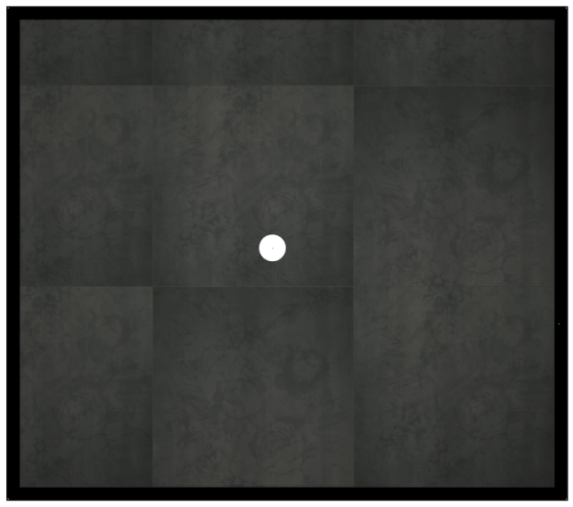

Tiler: Tile placement planning
===================================

Welcome to Tiler!

The idea behind this software is to create a tile placement plan based on the photos of actual tiles.
Usually the software used for tile placement planning takes one picture representing a tile
(in most cases it is not a photo but a digitally generated image) and uses it n times to cover all
the target area with multiple copies of this single tile. In practice the actual look of tiles never
corresponds to this artificially created image since some tiles can have slight differences in color
and pattern. Another issue with such tile placement planning is that the orientation of single tiles is
rarely considered resulting in placement plans like this one:

